# Career Navigator

Career Navigator is a resume-to-role intelligence system with two retrieval paths:

- **Static RAG path** — deterministic matching against a curated local job index.
- **Live ATS path** — near-real-time role discovery from Greenhouse boards, with multi-stage LLM filtering and semantic re-ranking.

Both paths use structured LLM outputs (Pydantic) and FAISS-based semantic retrieval to produce actionable fit/gap analysis.

## Ethical Disclaimer

This project is for **educational and portfolio purposes only**.

The ATS extraction capability in `ats_mcp_server.py` is implemented exclusively to demonstrate data engineering, retrieval, and LLM orchestration techniques in a local development environment. Job postings are fetched and processed in-memory at runtime for analysis and are not persisted for commercial use, redistribution, or resale.

Users are solely responsible for operating this code in compliance with applicable laws, platform Terms of Service, and rate/access restrictions.

## Architecture Overview

### 1) Static RAG Pipeline (`Analyze Resume`)

1. `build_vector_db.py` loads `data/jobs.json` and builds a persistent FAISS index on disk.
2. `app.py` (or `analyze_cv.py`) extracts PDF text via `pypdf`.
3. Resume text is embedded and queried against FAISS (`k=1`).
4. The matched job context is analyzed by `gpt-4o` with Pydantic structured output.
5. UI renders matching skills, missing skills, and a rewritten professional summary.

### 2) Live ATS Search + Re-Ranked RAG (`Search Live ATS Jobs`)

`run_live_job_search()` in `live_jobs.py` implements a multi-stage pipeline:

1. **CV profile distillation** (`gpt-4o-mini`) — extracts a compact technical summary **and** a set of high-signal `title_keywords` (e.g., `["Scientist", "Machine Learning", "Algorithm"]`) used as discriminative filters in the next step.
2. **ATS MCP extraction** — the local `ats_mcp_server.py` MCP server is invoked via `langchain-mcp-adapters`. All configured Greenhouse board URLs are queried in parallel with `asyncio.gather`. Each board is fetched via the public Greenhouse Jobs API (`boards-api.greenhouse.io`). After deduplication and shuffling, job titles are translated to English concurrently (`gpt-4o-mini`) so that the keyword filter works correctly on non-English titles. The title keyword filter is then applied (case-insensitive substring match against `title_keywords`), followed by the `_MAX_JOBS` cap and a minimum description-length check. Finally, descriptions are translated to English concurrently. All of this happens inside `_discover_jobs_via_ats_mcp()` before control returns to the main pipeline.
3. **Three-tier suitability classification** (`gpt-4o-mini`) — postings are labelled `suitable`, `borderline`, or `reject` based on required day-to-day skills (not job title). Analyst/BI/junior-heavy postings are filtered out. A tiered safety net progressively relaxes the threshold if fewer than 3 suitable jobs pass.
4. **In-memory FAISS index** — qualified job descriptions are embedded with `OpenAIEmbeddings` and stored in a FAISS index using `DistanceStrategy.COSINE` (required for un-normalized OpenAI embeddings; inner-product distance on unit vectors equals cosine similarity).
5. **HyDE retrieval** — instead of querying with the raw CV profile, `gpt-4o-mini` generates a hypothetical ideal job description (Hypothetical Document Embedding) that matches the candidate. This query is issued in job-description embedding space, dramatically improving retrieval precision for asymmetric corpora. Top 20 candidates are retrieved.
6. **Domain gate + fit scoring** (`gpt-4o-mini`) — each candidate receives a structured `_JobScore` with three fields evaluated in order:
   - `is_same_domain` (bool) — if `False` (e.g., a Sales or HR role for a Data Scientist), the score is **hard-capped at 1** with no exceptions. This prevents off-domain roles from ever surfacing as results.
   - `score` (int 1–10) — combined Rigor × Candidate Fit score, only applied when `is_same_domain` is `True`.
   - `rationale` (str) — one-sentence explanation of the verdict.
7. **Deep fit/gap analysis** (`gpt-4o`) — only the top 3 scored jobs receive a full `matching_skills` / `missing_skills` / `summary` analysis. This keeps the expensive model usage tightly gated.

### Model allocation

| Model | Used for |
|---|---|
| `gpt-4o-mini` | CV profile + keyword extraction, title + description translation, suitability classification, HyDE query generation, domain gate + scoring |
| `gpt-4o` | Deep gap analysis on top 3 results only |

### MCP server (`ats_mcp_server.py`)

A locally-run FastMCP server exposing a single tool: `extract_jobs_from_ats(url)`.

- Detects the ATS provider from the URL (Greenhouse or Comeet).
- For **Greenhouse**: calls the public Jobs API (`boards-api.greenhouse.io/v1/boards/{token}/jobs?content=true`), strips HTML from descriptions.
- For **Comeet**: resolves `company_uid` and `token` from URL path or page HTML, then calls the Comeet careers API. Currently not used (Comeet endpoints returning HTTP 400 as of 2026-05-07).
- Returns a JSON string (`[{title, location, description, url}, ...]`).

`live_jobs.py` connects to this server via stdio transport using `MultiServerMCPClient`.

## Architecture Flowchart

```mermaid
flowchart TD
    INPUT([📄 PDF Resume\nUploaded via Streamlit UI])

    INPUT --> EXTRACT[pypdf\nExtract raw text from all pages]

    EXTRACT --> PATH{Which button\nwas clicked?}

    %% ── STATIC RAG PATH ──────────────────────────────────────────
    PATH -->|Analyze Resume| SR1

    subgraph STATIC["Static RAG Path"]
        SR1[Load pre-built FAISS index\nfrom faiss_index/ on disk]
        SR1 --> SR2[Embed resume text\ntext-embedding-ada-002]
        SR2 --> SR3[FAISS similarity_search\nk=1 — nearest job description]
        SR3 --> SR4[gpt-4o structured output\n_CareerAnalysis_]
        SR4 --> SR5[matching_skills · missing_skills\nrewritten_summary]
    end

    SR5 --> STATIC_OUT([✅ Static results\nrendered in UI])

    %% ── LIVE ATS PATH ────────────────────────────────────────────
    PATH -->|Search Live ATS Jobs| L1

    subgraph LIVE["Live ATS Path  —  live_jobs.py · run_live_job_search()"]

        subgraph S2["Stage 1 · CV Distillation"]
            L1[gpt-4o-mini\n_build_cv_profile]
            L1 --> L1A[summary\n≤150-word technical profile]
            L1 --> L1B[title_keywords\n3–5 discriminative title nouns\ne.g. Scientist · Machine Learning]
        end

        subgraph S3["Stage 2 · ATS Extraction  —  _discover_jobs_via_ats_mcp()"]
            L1B --> L4
            L1 --> L2
            L2[Spawn MCP server as subprocess\nMultiServerMCPClient stdio]
            L2 --> L2A[Query ALL Greenhouse boards\nasyncio.gather — in parallel]
            L2A --> L2B[GET boards-api.greenhouse.io\nv1/boards/token/jobs?content=true\nStrip HTML · parse JSON]
            L2B --> L2C[Deduplicate by URL\nrandom.shuffle]
            L2C --> L2D[gpt-4o-mini × N concurrent\nTranslate titles to English\nasyncio.gather + asyncio.to_thread]
            L2D --> L4[Pure string match — no LLM\nKeyword filter on translated titles\nCap at 60 jobs · Drop descriptions under 200 chars\nSafety net: if 0 match → keep all]
            L4 --> L3[gpt-4o-mini × N concurrent\nTranslate descriptions to English\nasyncio.gather + asyncio.to_thread]
        end

        subgraph S4["Stage 3 · Suitability Classification"]
            L3 --> L5[gpt-4o-mini × N\n_classify_job\nJudge by day-to-day skills\nnot job title]
            L5 --> C1[✅ suitable\nModel training · NLP · CV\nMLOps · GenAI]
            L5 --> C2[🟡 borderline\nML mixed with SQL\nor reporting]
            L5 --> C3[❌ reject\nBI · SQL-only · ETL\nno modelling · junior]
            C1 & C2 & C3 --> TIER[Tiered safety net\n1st: suitable only\n2nd: + borderline\n3rd: exclude reject\n4th: keep all]
        end

        subgraph S5["Stage 4 · In-Memory FAISS Index"]
            TIER --> L6[Embed all qualified descriptions\ntext-embedding-ada-002\nFAISS.from_documents\nDistanceStrategy.COSINE]
        end

        subgraph S6["Stage 5 · HyDE Retrieval"]
            L6 --> L7[gpt-4o-mini — _build_hyde_query\nGenerate synthetic ideal job description\nfor this candidate — HyDE technique]
            L7 --> L7A[FAISS similarity_search\nquery in job-description space\nReturn top k=20 by cosine similarity]
        end

        subgraph S7["Stage 6 · Domain Gate + Fit Scoring"]
            L7A --> L8[gpt-4o-mini × 20\n_score_job — _JobScore]
            L8 --> DG{is_same_domain?}
            DG -->|No — Sales · HR\nMarketing etc.| DG1[Hard-cap score = 1\nno exceptions]
            DG -->|Yes| DG2[Score 1–10\nAxis 1 × Scientific Rigor\nAxis 2 × Candidate Stack Match]
            DG1 & DG2 --> RANK[Sort descending\nKeep top 3 above threshold\n7 → 6 → 5 → 0]
        end

        subgraph S8["Stages 7–9 · Deep Gap Analysis  —  top 3 only"]
            RANK --> GA1[gpt-4o · Job 1\n_analyze_match]
            RANK --> GA2[gpt-4o · Job 2\n_analyze_match]
            RANK --> GA3[gpt-4o · Job 3\n_analyze_match]
            GA1 & GA2 & GA3 --> MERGE[matching_skills · missing_skills\nfit summary · score · rationale]
        end

    end

    MERGE --> LIVE_OUT([🎯 Top 3 ranked job cards\nScore badge · Rationale\nMatching & missing skills\nLink to original posting])
```



### Model allocation

| Model | Stage | Purpose |
|---|---|---|
| `gpt-4o-mini` | 1, 2, 3, 5, 6 | CV distillation · title + description translation · classification · HyDE · scoring |
| `gpt-4o` | 7–9 | Deep gap analysis — top 3 results only |
| `text-embedding-ada-002` | Static SR2, Live S4 | FAISS index building and querying |

## Repository Files

| File | Purpose |
|---|---|
| `app.py` | Streamlit UI — static analysis and live ATS search |
| `live_jobs.py` | Full live-search pipeline: ATS extraction, filtering, retrieval, scoring, analysis |
| `ats_mcp_server.py` | Local MCP server wrapping Greenhouse/Comeet public APIs |
| `build_vector_db.py` | Offline FAISS index build from `data/jobs.json` |
| `analyze_cv.py` | CLI version of the static RAG analysis |
| `test_connection.py` | Verifies `OPENAI_API_KEY` is valid and reachable |

## Technology Stack

- Python 3.12
- Streamlit
- LangChain (`langchain-openai`, `langchain-community`, `langchain-mcp-adapters`)
- OpenAI: `gpt-4o-mini` (triage/scoring/translation), `gpt-4o` (deep analysis), `text-embedding-ada-002` (FAISS)
- FAISS (`faiss-cpu`) with `DistanceStrategy.COSINE`
- FastMCP (`mcp`)
- `httpx` (ATS API calls in `ats_mcp_server.py`)
- `pypdf`
- `python-dotenv`
- `uv` for dependency and environment management

## Setup

Prerequisites: Python 3.12+, [`uv`](https://docs.astral.sh/uv/getting-started/installation/), `OPENAI_API_KEY`.

```bash
uv sync
```

Create a `.env` file at the project root:

```
OPENAI_API_KEY=sk-...
```

## Running

Build the static FAISS index (required for the static analysis path only):

```bash
uv run python build_vector_db.py
```

Launch the Streamlit app:

```bash
uv run streamlit run app.py
```

CLI static analysis:

```bash
uv run python analyze_cv.py
uv run python analyze_cv.py path/to/resume.pdf
```

Connectivity check:

```bash
uv run python test_connection.py
```

## Operational Notes

- The live ATS path requires no prebuilt index — it builds an ephemeral in-memory FAISS index at search time.
- The static path requires a prebuilt `faiss_index/` directory (run `build_vector_db.py` first).
- `data/` and `faiss_index/` are intentionally excluded from version control.
- ATS board availability depends on external API uptime. Boards returning HTTP 4xx are silently skipped; the pipeline raises only if **all** boards fail.
- The `_MAX_JOBS` cap (default 60) is applied after shuffling so no single board can fill the entire pool.
- To add new Greenhouse boards, append to `_SEED_ATS_URLS` in `live_jobs.py`. The Greenhouse board token is the path segment after `boards.greenhouse.io/`.
